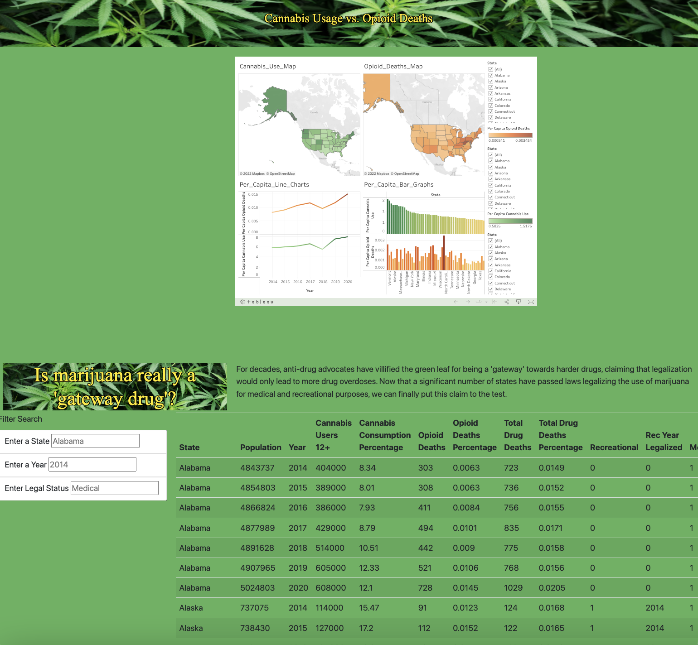

# UC Berkeley Extension Data Analytics Bootcamp Capstone Project, Group 13: "A Correlational Analysis of Cannabis Consumption and Opioid Misuse in the United States"
 

## Site Design

### Purpose

The purpose of this segment of the project was serve as a storyboard for our project as a whole. In addition to stating the reasons behind the project, our goal was to display all of the results we had collected through the course of this investigation on a single webpage so that users can filter the data by state, year, and legal status and see the results for themselves. The site would also include a Tableau element that displayed graphical visualizations of our project. 

## Goals to Achieve and Questions to Answer

Our objective is to create an interactive webpage that provides users with state-specific visualizations based on datasets from reliable sources (NIH, CDC, etc.) to see whether there are answers within the data to the following questions:

1. Is there consistently a negative correlation in all / most states between reported cannabis consumption and opioid misuse/deaths?

2. In states that have legalized medical and/or recreational marijuana, has there been a greater / sharper decline in reported opioid misuse/deaths in the year(s) following legalization, compared to states that have not yet lifted restrictions?

To make this possible however, it meant that the filter function had to work properly in displaying the correct data. It also meant that the Tableau dashboard had to be successfully imbedded within the HTML code so that it would not just be an image, but a fully functioning interavtice element.

## Communication Protocols
Our team meets 4 times a week: 
  - twice a week in class via Zoom
  - twice a week outside of class via GoogleMeets

Outside of meetings, we communicate via Slack chat threads to keep one another up-to-date on our progress and new ideas.

We've agreed to keep the division of responsibility less formal and siloed than what is suggested in the Canvas Module 20 instructions.  Team members have not been assigned "shapes" that designate their roles; we've instead agreed to each contribute wherever our strengths allow us to, while requesting input and help from others as needed.  Each section of our project can therefore have more than one contributor, and each team member has contributed to more than one branch in this repository.
  
We will document our processes, challenges and conclusions in full detail in the following READMEs:
- Data Collection, Cleaning and Analysis: John Landeen, Albert Zeng, Janasia Roemling
- Dataframes Construction and ERD: Albert Zeng, Jorge Jurado, Paula Adams
- Machine Learning Models: John Landeen
- Dashboard and Visualizations: Jorge Jurado, Janasia Roemling, Paula Adams

## Project Outline

The creation of this comprehensive webpage involved the use of JavaScript and HTML. The index file contained the HTML code, which used elements from bootstrap for the title. The static folder included two JavaScript files: data.js and app.js. For the data file, we converted the percaps_w_legality csv file into a .json file so that it could be easily read by the index. The Tableau dashboard was added to the index file and successfully displayed at the center of the page above the data table. A separate style.css file was used with the site design to create the aesthetics of the site. Perhaps the most challenging part of the site was creating a working filter search function that would allow the use to filter the table by state, year, and legal status. While the state and legal status worked without issue, the year did not since it was an integer rather than a string. To solve this issue, we needed to revisit the app.js and specify that the input in that particular box would be an integer. 

